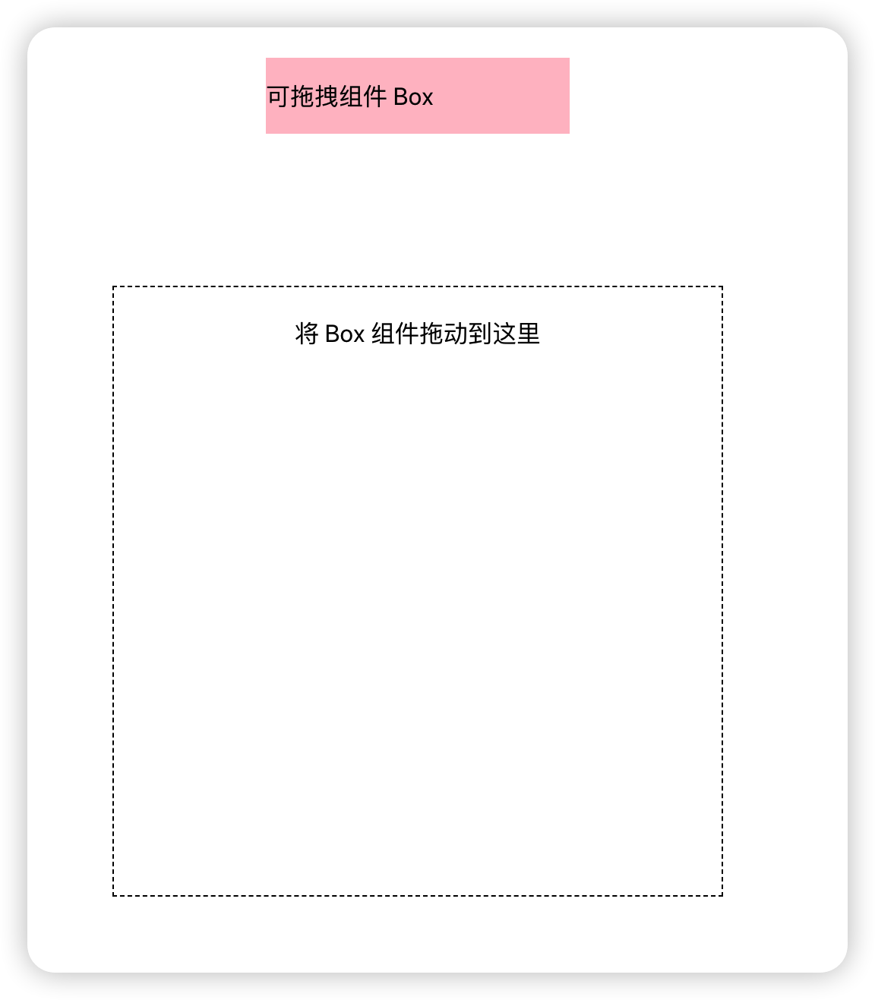
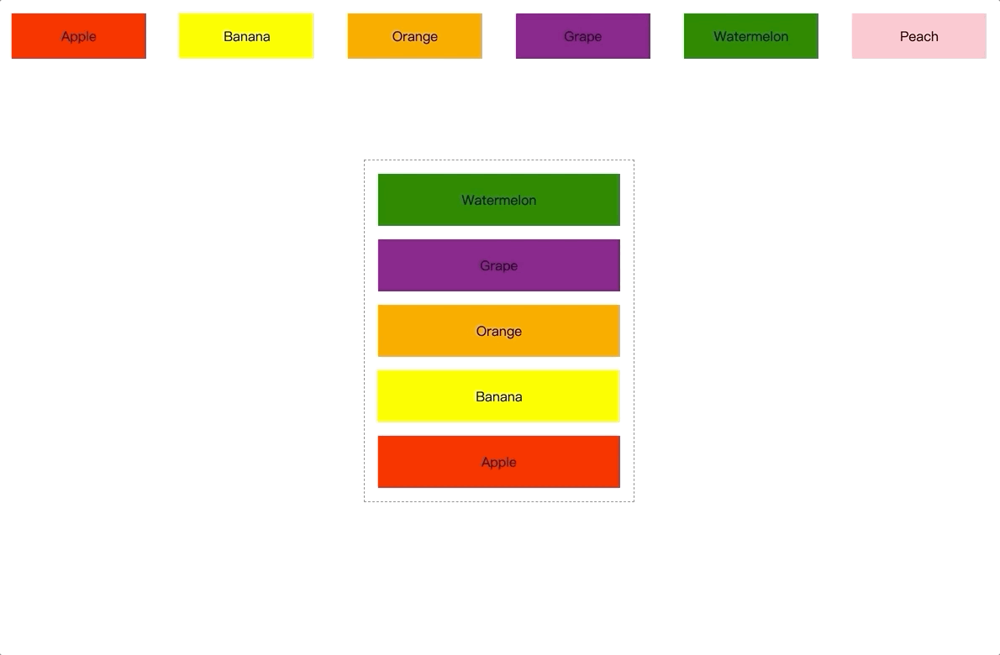

# 用 React Hooks 的方式使用 react-dnd

## 一、用 DndProvider 将根节点包裹起来

想要使用 react-dnd 进行拖拽操作，需要用 DndProvider 标签将根节点包裹起来，并传入一个 backend 参数： index.tsx 文件

~~~tsx
import React from 'react';
import ReactDOM from 'react-dom';
import { DndProvider } from 'react-dnd';
import HTMLBackend from 'react-dnd-html5-backend'
import './index.css';
import App from './App';

ReactDOM.render(
    <DndProvider backend={ HTMLBackend }>
        <App />
    </DndProvider>,
    document.getElementById('root'));
~~~

## 二、让元素可以动起来

1. 创建 Box 组件
2. 让 Box 组件动起来

就简单创建一个BOX组件，这里我们需要用到react-dnd的useDrag方法， 这里通过把第二参数赋值给ref，Box组件就能动起来，至于为什么，以后会给讲
源码

~~~tsx
import React, { CSSProperties } from 'react';
import { useDrag } from 'react-dnd';
const style: CSSProperties = {
  width: 200,
  height: 50,
  lineHeight: '50px',
  background: 'pink',
  margin: '30px auto',
};

const Box = () => {
    const [, drager] = useDrag({
        type: 'Box'
    })
  return (
可拖拽组件 Box
);
};

export default Box;
~~~

## 三、创建 Dustbin 组件用来接收 drag 组件

~~~tsx
import React, { CSSProperties } from 'react';
import { useDrop, DropTargetMonitor } from 'react-dnd';

const style: CSSProperties = {
    width: 400,
    height: 400,
    margin: '100px auto',
    lineHeight: '60px',
    border: '1px dashed black'
}

const Dustbin = () => {
    // 第一个参数是 collect 方法返回的对象，第二个参数是一个 ref 值，赋值给 drop 元素
    const [collectProps, droper] = useDrop({
        // accept 是一个标识，需要和对应的 drag 元素中 item 的 type 值一致，否则不能感应
        accept: 'Box',
        // collect 函数，返回的对象会成为 useDrop 的第一个参数，可以在组件中直接进行使用
        collect: (minoter: DropTargetMonitor) => ({
            isOver: minoter.isOver()
        })
    })
    const bg = collectProps.isOver ? 'deeppink' : 'white';
    const content = collectProps.isOver ? '快松开，放到碗里来' : '将 Box 组件拖动到这里'
    return (
        // 将 droper 赋值给对应元素的 ref
        
{ content }

    )
}

export default Dustbin;
~~~

## 四、效果图

## 五、其它一些api

- drag 组件常用的属性：
  - item：是一个对象，必须要有一个 type 属性
  - begin(mintor: DragSourceMonitor)：组件开始拖拽，必须返回一个对象包含 type 属性，会覆盖 item 属性返回的对象，会被传入 drop 组件 hover 和 drop 方法的第一个参数
  - end(item, mintor: DragSourceMonitor)： 组件停止拖拽时触发，item 是 drop 组件在 drop 方法执行时返回的对象，等同于 mintor.getDropResult() 的值

- drop 组件常用的属性
  - accept：字符串，必须和对应 drag 组件的 item 属性中的 type 值一致
  - hover(item, minoter: DropTargetMonitor)：drag 组件在 drop 组件上方 hove 时触发
  - drop(item, minoter: DropTargetMonitor)：drag 组件拖拽结束后，放到 drop 组件时触发，返回的值会作为参数传递给 drag 组件 end 方法的第一个参数

- 让组件既可以被拖拽也可以接收拖拽元素

~~~tsx
import React, { useRef } from 'react';
import { useDrag, useDrop } from 'react-dnd';

const Card = () => {
  const ref = useRef<HTMLDivElement>(null);

  const [, drop] = useDrop({
    accept: 'Card',
    drop(item) {
      console.log(item);
    },
  });

  const [, drag] = useDrag({
    type: 'Card',
    item: { id: '1' },
    end(draggedItem, monitor) {
      console.log(draggedItem, monitor);
    },
  });

  // 使用 drag 和 drop 包装 ref
  drag(drop(ref));

  // 将变量 ref 传给元素的 ref 即可
  return 
既可以被拖动也可以接收拖动组件
;
};

export default Card;

~~~
## 一个更复杂的 Demo 演示

Demo 地址

[react-dnd-hooks-demo]()

